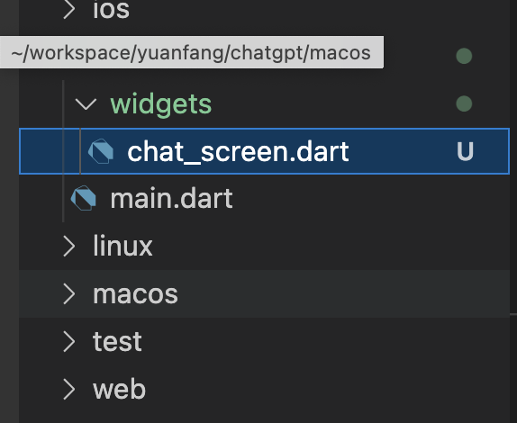

## 客户端 UI 分析

ChatGPT 既然是Chat，那总归需要有个聊天窗口的，我们先来看下ChatGPT的界面。非常简单，总共三部分：聊天窗口、历史记录、其他。本章节我们先来专注于聊天窗口这部分。


### 聊天窗口

我们来分析下如何使用Flutter的基础组件，一步步做出这个界面。

1. 聊天消息列表：
   - 使用`ListView.builder`来创建一个可滚动的聊天消息列表。这种方法可以根据需要加载列表项，提高性能。
   - 对于每条消息，创建一个自定义的消息组件，包括文本、头像、时间戳等元素。可以使用`Container`、`Row`和`Column`等布局组件来组织这些元素。
   - 根据消息的发送者（用户或ChatGPT）来调整消息组件的对齐方式和样式。例如，用户消息可以显示在右侧，ChatGPT消息显示在左侧。

2. 输入框消息发送按钮
   - 使用`TextField`组件创建一个输入框，用户可以在其中输入消息。可以自定义输入框的样式，如边框、背景色、字体等。
   - 创建一个发送按钮，可以使用`IconButton`。将按钮与输入框放在同一行，可使用`Row`组件进行布局。
   - 为发送按钮添加点击事件。当用户点击发送按钮时，将输入框中的文本添加到消息列表，并清空输入框。

3. 其他UI元素和功能
   - 添加一个顶部的app bar，显示聊天界面的标题或其他功能按钮（如设置、帮助等）。

通过结合这些设计元素和功能，你将能够创建一个功能完善、易于使用的聊天界面。请注意，界面设计应该保持简洁且直观，确保用户能够轻松地与ChatGPT进行交互。接下来我们来具体实现：

#### 新建一个 chatgpt 项目

1. 首先创建一个 Flutter 项目 `flutter create chatgpt`

2. 使用 vscode 打开下项目，你会看到一下内容

   

3. F5 运行一下项目，选择你喜欢的平台，web、windows、macOS、Android、iOS都可以，这里以macOS为例

   

4. 能看到以上界面说明成功了，接下来我们进入正题

#### 创建聊天窗口

1. 新建一个`widgets` 文件夹，新建一个 `chat_screen.dart`

   

2. 新建一个 `ChatScreen` class 

   ```dart
   import 'package:flutter/material.dart';
   
   class ChatScreen extends StatelessWidget {
     const ChatScreen({super.key});
   
     @override
     Widget build(BuildContext context) {
       return Scaffold(
         appBar: AppBar(
           title: const Text('Chat'),
         ),
         body: const Center(
           child: Text('Chat Screen'),
         ),
       );
     }
   }
   ```

3. 修改 `main.dart`, 改为一下代码

   ```dart
   import 'package:chatgpt/widgets/chat_screen.dart';
   import 'package:flutter/material.dart';
   
   void main() {
     runApp(const MyApp());
   }
   
   class MyApp extends StatelessWidget {
     const MyApp({super.key});
   
     // This widget is the root of your application.
     @override
     Widget build(BuildContext context) {
       return MaterialApp(
         title: 'ChatGPT',
         theme: ThemeData(
           primarySwatch: Colors.blue,
         ),
         home: const ChatScreen(),
       );
     }
   }
   
   ```

4. F5 运行一下，看下效果

   

5. 继续修改 `build` 函数

   ```dart
   Widget build(BuildContext context) {
     Widget build(BuildContext context) {
       return Scaffold(
        // 省略。。。
         body: Padding(
           padding: const EdgeInsets.all(8.0),
           child: Column(
             children: [
               Expanded(
                 // 聊天消息列表
                 child: ListView.separated(
                   itemBuilder: (context, index) {
                     return Row(
                       children: [
                         const CircleAvatar(
                           child: Text('A'),
                         ),
                         const SizedBox(
                           width: 8,
                         ),
                         Text('Message $index'),
                       ],
                     );
                   },
                   itemCount: 5, // 消息数量
                   separatorBuilder: (context, index) => const SizedBox(
                     height: 8,
                   ),
                 ),
               ),
               // 输入框
               TextField(
                 decoration: InputDecoration(
                     hintText: 'Type a message', // 显示在输入框内的提示文字
                     suffixIcon: IconButton(
                       onPressed: () {
                         // 这里处理发送事件
                       },
                       icon: const Icon(
                         Icons.send,
                       ),
                     )),
               ),
             ],
           ),
         ),
       );
   ```

   增加了两部分，一个部分是消息列表，底部是输入框

   

   基本页面显示完成了，接下来我们来设计下数据模型来存储消息

#### 数据模型

我们需要创建一个消息模型以存储和管理聊天消息。消息模型将包含消息的内容、发送者、时间戳等信息。以下是一个简单的消息模型示例：

1. 首先，在项目中创建一个名为`models`的新文件夹，并在其中创建一个名为`message.dart`的文件。
2. 在`message.dart`中，定义一个`Message`类，并为其添加以下属性：
   - `String content`：消息的文本内容。
   - `bool isUser`：标识消息是由用户发送还是由ChatGPT发送。`true`表示用户发送，`false`表示ChatGPT发送。
   - `DateTime timestamp`：消息的发送时间。

```dart
class Message {
  final String content;
  final bool isUser;
  final DateTime timestamp;

  Message({required this.content, required this.isUser, required this.timestamp});
}
```

3. 为了方便地创建和管理消息列表，可以为`Message`类添加一些实用方法，如：

- `toJson()`：将`Message`对象转换为JSON格式。
- `fromJson(Map<String, dynamic> json)`：从JSON数据中创建一个`Message`对象。

```dart

class Message {
  final String content;
  final bool isUser;
  final DateTime timestamp;

  Message({required this.content, required this.isUser, required this.timestamp});

  Map<String, dynamic> toJson() => {
        'content': content,
        'isUser': isUser,
        'timestamp': timestamp.toIso8601String(),
      };

  factory Message.fromJson(Map<String, dynamic> json) => Message(
        content: json['content'],
        isUser: json['isUser'],
        timestamp: DateTime.parse(json['timestamp']),
      );
}
```

现在我们已经创建了一个简单的消息模型，接下来可以使用这个模型来存储和显示聊天消息。

#### 组装数据到界面

1. 初始化数据, `ChatSreen` 类中初始化一下数据

   ```dart
   
     final List<Message> messages = [
       Message(content: "Hello", isUser: true, timestamp: DateTime.now()),
       Message(content: "How are you?", isUser: false, timestamp: DateTime.now()),
       Message(
           content: "Fine,Thank you. And you?",
           isUser: true,
           timestamp: DateTime.now()),
       Message(content: "I am fine.", isUser: false, timestamp: DateTime.now()),
     ];		
   ```

2. 更新下 Listview 中的数据

   ```dart
                           
   											// ....
                         ),
                         Text(messages[index].content),
                       ],
                     );
                   },
                   itemCount: messages.length, // 消息数量
   ```

   更新完成后，你会看到一下效果

   

3. 消息列表中，用户和ChatGPT的消息区分不开，我们需要重构下消息Item的内容, 新建`MessageItem` 类，根据 `isUser` 讲头像显示不同的背景色

   ```dart
   
   class MessageItem extends StatelessWidget {
     const MessageItem({
       super.key,
       required this.message,
     });
   
     final Message message;
   
     @override
     Widget build(BuildContext context) {
       return Row(
         children: [
           CircleAvatar(
             backgroundColor: message.isUser ? Colors.blue : Colors.grey,
             child: Text(
               message.isUser ? 'A' : 'GPT',
             ),
           ),
           const SizedBox(
             width: 8,
           ),
           Text(message.content),
         ],
       );
     }
   }
   
   
   // ....
         			// 聊天消息列表
                 child: ListView.separated(
                   itemBuilder: (context, index) {
                     return MessageItem(message: messages[index]);
                   },
                   itemCount: messages.length, // 消息数量
                   separatorBuilder: (context, index) => const Divider(
                     height: 16,
                   ),
                 ),
               ),
   ```

   

#### 用户输入

1. 为了后去输入框的内容，需要给 `textfield`绑定一个controller，我们在ChatScreen中新建一个

   ```dart
    final _textController = TextEditingController();
   
   //...
   
        // 输入框
               TextField(
                 controller: _textController,  //这里绑定
   ```

2. 新建一个函数来处理输入框的内容

   ```dart
   
     _sendMessage(String content) {
       final message =
           Message(content: content, isUser: true, timestamp: DateTime.now());
       messages.add(message);
       _textController.clear();
     }
   ```

3. 在按钮的点击事件中绑定此函数

   ```dart
               suffixIcon: IconButton(
                       onPressed: () {
                         // 这里处理发送事件
                         if (_textController.text.isNotEmpty) {
                           _sendMessage(_textController.text);
                         }
                       },
   ```

4. 在输入框中输入文字，点击按钮测试下，输入框的内容被清除了，但是界面上没有任何更新。接下来就是我们后面需要做的事情，Flutter 开发中的状态管理。