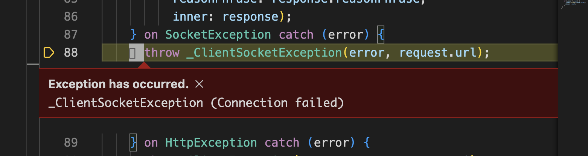

## ChatGPT API 接入

在开始本章节之前，我们默认你已经注册过 openai 账号，并且已经获取到了相应的 api key。如果没有的话，请自行baidu 解决。

### ChatGPT SDK vs API

ChatGPT 有两种方式接入，直接使用[官方API](https://platform.openai.com/docs/api-reference)，或者使用社区的SDK。为了简单我们直接使用[openai_api - dart SDK](https://pub.dev/packages/openai_api)来处理次问题。

#### openai_api

此SDK提供了我们客户端开发需要2个关键API （ChatCompletion 以及 Whisper），同时提供了代理以及自建API服务的支持。

### 开始接入

1. 添加依赖 `flutter pub add openai_api`

2. 新建一个`services`文件夹，并创建一个`chatgpt_service.dart`

   ```dart
   import 'package:openai_api/openai_api.dart';
   
   class ChatGPTService {
     final client = OpenaiClient(
       config: OpenaiConfig(
         apiKey: "", // 你的key
         baseUrl: "",  // 如果有自建反向代理请设置这里
         httpProxy: "",  // 代理服务地址
       ),
     );
   
     Future<ChatCompletionResponse> sendChat(String content) async {
       final request = ChatCompletionRequest(model: Model.gpt3_5Turbo, messages: [
         ChatMessage(
           content: content,
           role: ChatMessageRole.user,
         )
       ]);
       return await client.sendChatCompletion(request);
     }
   }
   
   ```

   

3. 新建一个 `injection.dart` 初始化 service

   ```dart
   import 'package:chatgpt/services/chatgpt.dart';
   
   final chatgpt = ChatGPTService();
   
   ```

   

4. `ChatScreen` 增加新方法 `_requestChatGPT`，在`_sendMessage` 调用

   ```dart
     _requestChatGPT(WidgetRef ref, String content) async {
       final res = await chatgpt.sendChat(content);
       final text = res.choices.first.message?.content ?? "";
       final message =
           Message(content: text, isUser: false, timestamp: DateTime.now());
       ref.read(messageProvider.notifier).addMessage(message);
     }
   
   // ..
   
     // 增加WidgetRef
     _sendMessage(WidgetRef ref, String content) {
   			//...
       _requestChatGPT(ref, content);
     }
   
   
   ```

   

5. 运行一下，输入hello发送，看到以下结果说明正常了

   

   > 如果碰到如下错误信息，则是网络权限问题
   >
   > 
   >
   > 
   >
   > macOS上需要在 `DebugProfile.entitlements` 和 `ReleaseProfile.entitlements`文件中增加配置, 重新编译即可
   >
   > ```xml
   > 		<key>com.apple.security.network.client</key>
   > 		<true />
   > ```

到这里我们就完成了ChatGPT API 接入。

### .env 来管理敏感配置

敏感的 apikey 参数直接配置到代码中是非常不安全的，在其他的语言中通常使用`.env`来管理环境变量，在Flutter中同样适用。

[envied](https://pub.dev/packages/envied) 是专门用来处理这个问题，详细使用方法请参照官方文档。

1. 安装依赖  ` flutter pub add envied dev:envied_generator dev:build_runner`

2. 新建`env.dart` 文件

   ```dart
   import 'package:envied/envied.dart';
   
   part 'env.g.dart';
   
   @Envied(path: ".env")
   abstract class Env {
     @EnviedField(varName: 'OPENAI_API_KEY')
     static const apiKey = _Env.apiKey;
   
     @EnviedField(varName: 'HTTP_PROXY', defaultValue: '')
     static const httpProxy = _Env.httpProxy;
   
     @EnviedField(varName: 'BASE_URL', defaultValue: '')
     static const baseUrl = _Env.baseUrl;
   }
   
   ```

   

3. 新建`.env`文件内部添加对应的环境变量

   ```bash
   OPENAI_API_KEY=sk-aaaaaaaaaaaa
   HTTP_PROXY=http://localhost:7890
   BASE_URL=https://openai.proxy.dev/v1
   ```

   

4. 生成代码 `flutter pub run build_runner build --delete-conflicting-outputs`

   

5. 讲`.env`和`env.g.dart`添加到 `.gitignroe`  中，即可避免敏感配置提交的代码中。

### 消息UI优化

1. 当消息太长试，UI 会出现异常的情况，接下来我们就来优化一下消息UI。


​	针对`MessageItem` 的修改如下

   ```dart
    Widget build(BuildContext context) {
       return Row(
         crossAxisAlignment: CrossAxisAlignment.start,
         mainAxisAlignment: MainAxisAlignment.start,
         children: [
           CircleAvatar(
             backgroundColor: message.isUser ? Colors.blue : Colors.blueGrey,
             child: Text(
               message.isUser ? 'A' : 'GPT',
             ),
           ),
           const SizedBox(
             width: 8,
           ),
           Flexible(
             child: Container(
               margin: const EdgeInsets.only(top: 12),
               child: Text(message.content),
             ),
           ),
         ],
       );
     }
   ```

​	修改效果如下：


2. ChatGPT 同时只能相应一个请求，所以在相应还么有返回时，输入框应该无法发送消息

   - `states`中新建 `chat_ui_state.dart`

     ```dart
     import 'package:hooks_riverpod/hooks_riverpod.dart';
     
     class ChatUiState {
       final bool requestLoading;
       ChatUiState({
         this.requestLoading = false,
       });
     }
     
     class ChatUiStateProvider extends StateNotifier<ChatUiState> {
       ChatUiStateProvider() : super(ChatUiState());
     
       void setRequestLoading(bool requestLoading) {
         state = ChatUiState(requestLoading: requestLoading);
       }
     }
     
     final chatUiProvider = StateNotifierProvider<ChatUiStateProvider, ChatUiState>(
       (ref) => ChatUiStateProvider(),
     );
     
     ```

     

   - `ChatScreen` 中更新相 输入框相关的状态

     ```dart
       Widget build(BuildContext context, WidgetRef ref) {
         // ...
     		final chatUIState = ref.watch(chatUiProvider);
     
         //...
               TextField(
                   enabled: !chatUIState.requestLoading,
                 
     ```

     ```dart
       _requestChatGPT(WidgetRef ref, String content) async {
         ref.read(chatUiProvider.notifier).setRequestLoading(true);
         final res = await chatgpt.sendChat(content);
         ref.read(chatUiProvider.notifier).setRequestLoading(false);
         //...
     ```

   - 运行代码验证，在发送请求之后，输入框不可使用